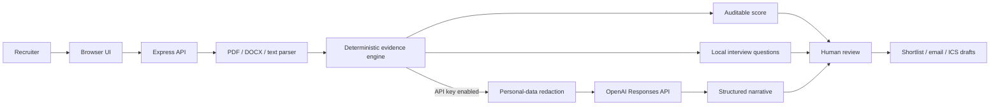

# ShortlistAI

ShortlistAI is a portfolio-ready recruitment screening agent. It reads résumés, compares job-related evidence against a recruiter-defined rubric, prepares candidate summaries and structured interview questions, and drafts interview invitations. It does **not** automatically reject candidates or send messages.

The project is intentionally hybrid:

- A deterministic engine calculates the score, so every point is explainable.
- An optional OpenAI model improves summaries and interview questions.
- A recruiter approves shortlisting and scheduling actions.

The app works without an API key in local demo mode.

## What the demo does

1. A recruiter defines a role, minimum experience, and required/preferred skills.
2. The agent reads as many as 10 PDF, DOCX, TXT, or Markdown résumés.
3. It extracts candidate contact information and job-relevant evidence.
4. It calculates an auditable match score and shows missing evidence.
5. It creates five evidence-based interview questions for each candidate.
6. A human can add candidates to a shortlist.
7. The agent drafts an invitation email and downloadable calendar file. Nothing is sent automatically.
8. Results can be exported as CSV.

## Applications you need

| Application | Required? | What it is used for |
|---|---:|---|
| [Node.js](https://nodejs.org/) 20 or newer | Yes | Runs the web server and installs packages. |
| [Visual Studio Code](https://code.visualstudio.com/) | Recommended | Opens and edits the project. Any code editor works. |
| Chrome, Edge, Firefox, or Safari | Yes | Opens the web interface. |
| [OpenAI API account](https://platform.openai.com/) | Optional | Enables AI-written summaries and interview questions. Local scoring works without it. |
| Git and GitHub | Recommended | Version control and portfolio sharing. |
| Postman | Optional | Manually tests API endpoints; it is not needed for the demo. |

You do **not** need Python, Docker, a database, or a paid API account to run the basic demo.

## Quick start on Windows

Open PowerShell in this project folder:

```powershell
git clone https://github.com/rbd1411/shortlist-ai-recruitment-agent.git
cd shortlist-ai-recruitment-agent
npm ci
npm start
```

Open [http://localhost:3210](http://localhost:3210) in a browser.

Then:

1. Select **Load example**.
2. Confirm that three fictional résumé files appear.
3. Select **Analyze candidates**.
4. Open each candidate and review the evidence and questions.
5. Select **Shortlist** for a suitable candidate.
6. Select **Schedule**, choose a time, and select **Prepare invitation**.
7. Review the email draft or download the `.ics` calendar event.

Stop the server with `Ctrl+C` in PowerShell.

## Enable optional OpenAI enrichment

The local engine already scores résumés and generates questions. To improve the narrative language with an OpenAI model:

1. Create an API key in your OpenAI Platform account.
2. Copy the example environment file:

```powershell
Copy-Item .env.example .env
```

3. Open `.env` in VS Code and set:

```dotenv
OPENAI_API_KEY=your_key_here
OPENAI_MODEL=gpt-5.4-mini
PORT=3210
```

4. Restart the server with `npm start`.
5. The header should show **Hybrid AI**. Leave **AI narrative enrichment** enabled before analyzing.

Never put an API key in `public/app.js`, commit `.env`, paste a key into a screenshot, or expose it in browser code. API usage can incur charges and depends on the models available to your OpenAI project.

The implementation uses the [OpenAI Responses API](https://developers.openai.com/api/reference/resources/responses/methods/create) with structured JSON output and `store: false`.

## Using your own résumés

1. Replace the example role with the actual job title and description.
2. Keep required skills short and objective. Avoid vague traits such as “culture fit,” “young,” or “energetic.”
3. Put genuinely optional capabilities under preferred skills.
4. Upload text-based PDF, DOCX, TXT, or MD files.
5. Review the original résumé alongside every extracted result.
6. Treat missing evidence as a question to verify—not proof that the candidate lacks a skill.
7. Use the score only to organize review order.

Scanned image-only PDFs need OCR, which this MVP does not provide. Export those files as text-based PDFs or DOCX files first.

## Architecture



### Why this is an agent

It has a goal, observes unstructured documents, invokes specialized tools, maintains workflow state, produces an action proposal, and waits for human approval before a consequential action. It is a bounded workflow agent rather than a free-running autonomous bot.

### Scoring rubric

| Component | Weight | Explanation |
|---|---:|---|
| Required skills | 55% | Percentage of explicitly listed required skills found in the résumé. |
| Preferred skills | 20% | Bonus evidence; not a hard rejection filter. |
| Experience baseline | 20% | Estimated years compared with the recruiter’s minimum. Dates should be verified manually. |
| Evidence completeness | 5% | Rewards enough résumé text to support review. |

The score is deterministic. The model cannot change it.

Recommendations are deliberately phrased as **Strong evidence**, **Potential fit**, and **Needs review**. There is no automatic rejection state.

## Project structure

```text
recruitment-screening-agent/
├── public/
│   ├── samples/           # Three fictional résumés
│   ├── app.js             # Browser behavior and workflow state
│   ├── index.html         # Accessible application structure
│   └── styles.css         # Responsive interface
├── src/
│   ├── analysis.js        # Deterministic extraction and scoring
│   └── openai.js          # Redacted structured-output enrichment
├── test/
│   ├── analysis.test.js   # Unit and fairness guard tests
│   └── api.test.js        # API workflow tests
├── .env.example
├── DEPLOYMENT.md
├── Dockerfile
├── INTERVIEW_GUIDE.md
├── package.json
└── server.js              # Express server, parsing, and endpoints
```

## API endpoints

### `GET /api/health`

Returns server readiness, whether an API key is configured, and the selected model.

### `POST /api/analyze`

Accepts multipart form data:

- `roleTitle`
- `minExperience`
- `requiredSkills`
- `preferredSkills`
- `jobDescription`
- `useAI`
- `resumes` (up to 10 files)

Returns ranked candidate evidence, questions, and analysis metadata.

### `POST /api/schedule`

Accepts candidate, role, date/time, duration, interviewer, and meeting-link data. Returns an email draft and ICS text. It never sends an email or creates an external calendar event.

## Tests

Run:

```powershell
npm test
```

The test suite verifies:

- Skill parsing and token-boundary matching
- Candidate/contact extraction
- Experience estimation
- Redaction of names, email, phone, and personal attributes
- Strong and unmatched candidate behavior
- Five interview questions
- Health, analysis, and scheduling APIs
- The “draft only” scheduling safeguard

## Privacy and responsible-use safeguards

- Candidate names, emails, phone numbers, and explicit personal attributes are redacted before optional model calls.
- The score uses only recruiter-entered skills, experience, and résumé evidence.
- The model writes narrative but cannot alter the deterministic score.
- API calls set `store: false`.
- No automatic rejection exists.
- No email or calendar action is sent automatically.
- The UI repeatedly tells the recruiter that manual review is required.
- Uploaded files remain in memory only and are not written to disk by this MVP.

For a production hiring system, obtain legal and security review for every jurisdiction where it will be used. Add consent, retention rules, access controls, audit logs, accessibility testing, adverse-impact monitoring, and a documented human appeals process.

## Production roadmap

This is deliberately an interview-sized MVP. A production version should add:

1. Authentication and recruiter/administrator roles
2. PostgreSQL with encrypted fields and retention jobs
3. Cloud object storage with malware scanning
4. OCR for scanned PDFs
5. A queue for large résumé batches
6. Google Calendar or Microsoft Graph integration with approval screens
7. An ATS connector such as Greenhouse or Lever
8. Versioned job rubrics and tamper-evident audit events
9. Model and prompt evaluations using labeled recruiter examples
10. Fairness monitoring across legally permitted, separately governed evaluation datasets
11. Accessibility review against WCAG
12. Rate limiting, CSRF protection, secrets management, and observability

## Troubleshooting

### `npm` is not recognized

Install Node.js 20 or newer, close PowerShell, open it again, and run `node --version` and `npm --version`.

### Port 3210 is already in use

Change `PORT` in `.env`, for example `PORT=3211`, restart, and open the matching URL.

### A PDF says there is not enough readable text

It is probably scanned or uses an unusual encoding. Export it as DOCX/TXT or run OCR before upload.

### AI enrichment does not appear

Confirm that `.env` exists, the key starts after `OPENAI_API_KEY=`, the server was restarted, and the health badge says **Hybrid AI**. If the API call fails, the app intentionally falls back to local analysis and displays a warning.

### A skill is missing even though it is on the résumé

This MVP performs explicit phrase matching. Add aliases in the role—for example, `PostgreSQL, Postgres`—or extend `containsSkill()` with an approved skill taxonomy.

## Important limitation

This project demonstrates engineering, agent design, safety boundaries, and user experience. It is not a certified hiring system and should not be used as the sole basis for employment decisions.
